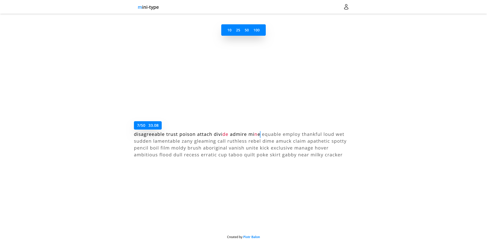

# mini-type

mini-type is a simple typing game heavily based on [monkeytype.com](https://monkeytype.com/).

### How does it calculate WPM?

WPM is the total number of characters in the correctly typed words (spaces included), divided by 5 and normalised to 60 seconds.

### Built with

- React
- Typescript
- Tailwind CSS
- Framer Motion